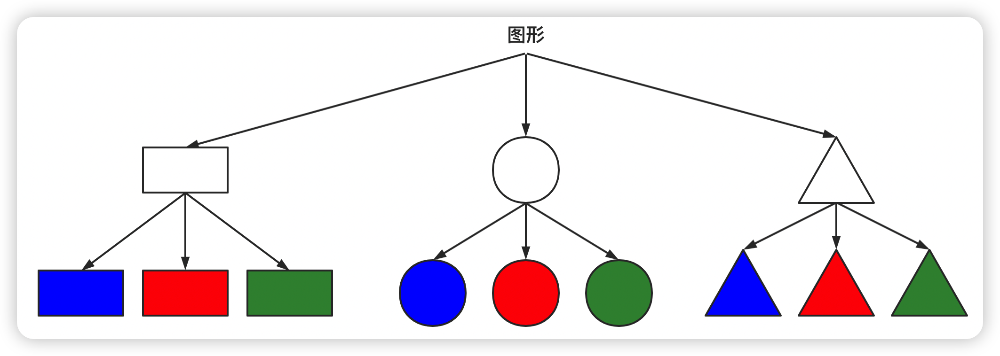
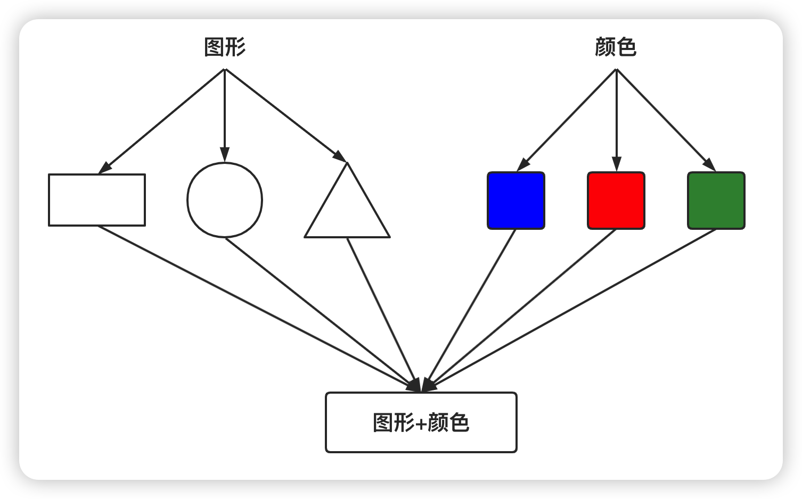

<div style="text-align: center">
    <h1>
    设计模式
    </h1>
</div>


## 1、设计模式

### 1.1、常用的设计模式

-   **创建性模式：**

    单例模式、工厂模式、抽象工厂模式、建造者模式、原型模式

-   **结构型模式：**

    适配器模式、桥接模式、装饰模式、组合模式、外观模式、享元模式，代理模式

-   **行为型模式：**

    模板模式、命令模式、访问者模式、迭代器模式、观察者模式、中介者模式、备忘录模式、解释器模式、状态模式、策略模式、职责链模式

### 1.2、设计模式的七大原则

-   单一职责原则
-   接口隔离原则
-   依赖倒转（倒置）原则
-   里氏替换原则
-   开闭原则（OCP）
-   迪米特法则
-   合成复用原则

### 1.3、设计模式

#### 《创建性模式》

#### 1.3.1、单例模式

单单例模式有八种方式：

1.  **饿汉式（静态常量）**

    ```java
    /**
     * 饿汉式（静态常量）
     */
    public class Singleton1 {
        // 直接创建
        private static final Singleton1 instance = new Singleton1();
    
        private Singleton1() {
        }
    
        public static Singleton1 getInstance() {
            return instance;
        }
    }
    ```

    优缺点说明：
    优点：在类装载的时候就完成实例化。避免了线程同步问题。
    缺点：在类装载的时候就完成实例化，没有达到Lazy Loading的效果。如果从始至终从未使用过这个实例，则会造成内存的浪费
    结论：这种单例模式可用，可能造成内存浪费

2.  **饿汉式（静态代码块）**

    ```java
    /**
     * 饿汉式（静态代码块）
     */
    public class Singleton2 {
        private static final Singleton2 instance;
    
        static {
            // 静态代码块中创建
            instance = new Singleton2();
        }
    
        private Singleton2() {
        }
    
        public static Singleton2 getInstance() {
            return instance;
        }
    }
    ```

    优缺点说明：这种方式和上面的方式其实类似，只不过将类实例化的过程放在了静态代码块中

3.  **懒汉式（线程不安全）**

    ```java
    /**
     * 懒汉式（线程不安全）
     */
    public class Singleton3 {
        private static Singleton3 instance;
    
        private Singleton3() {
        }
    
        public static Singleton3 getInstance() {
            // 获取实例时才创建
            if (instance == null) {
                instance = new Singleton3();
            }
            return instance;
        }
    }
    ```

    优缺点说明：
    1)起到了Lazy Loading的效果，但是只能在单线程下使用。
    2)如果在多线程下，一个线程进入了H (singleton =- nul)判断语句块，还未来得及往下热行，另一个线程也通过了这个判断语句，这时便会产生多个实例。所以在多线程环境下不可使用这种方式
    3)结论：在实际开发中，不要使用这种方式.

4.  **懒汉式（线程安全，同步方法）**

    ```java
    /**
     * 懒汉式（线程安全，同步方法）
     */
    public class Singleton4 {
        private static Singleton4 instance;
    
        private Singleton4() {
        }
    
        // 添加同步
        public static synchronized Singleton4 getInstance() {
            // 获取实例时才创建
            if (instance == null) {
                instance = new Singleton4();
            }
            return instance;
        }
    }
    ```

    优缺点说明：
    1)解决了线程不安全问题
    2)效率太低了，每个线程在想获得类的实例时候，执行getinstance()方法都要进行同步。而其实这个方法只执行一次实例化代码就够了，后面的想获得该类买例，直接return就行了。方法进行同步效率太低
    3)结论：在实际开发中，不推荐使用这种方式

5.  **懒汉式（线程安全，同步代码块）**

    ```java
    /**
     * 懒汉式（线程安全，同步代码块）
     */
    public class Singleton5 {
        private static Singleton5 instance;
        
        private Singleton5() {
        }
    
        public static Singleton5 getInstance() {
            // 获取实例时才创建
            if (instance == null) {
                // 添加同步,实际上无意义，当线程进入if，该实例就会被多次创建，并非单例了
                // 实际开发中不能这样使用
                synchronized (Singleton5.class) {
                    instance = new Singleton5();
                }
            }
            return instance;
        }
    }
    ```

    优缺点说明：
    1)这种方式，本意是想对第四种实现方式的改进，因为前面同步方法效率太低，改为同步产生实例化的的代码块
    2)但是这种同步并不能起到线程同步的作用。跟第3种实现方式遇到的情形一致，假如一个线程进入了if (singleton == nul)判断语句块，还未来得及往下执行，另一个线程也通过了这个判断语句，这时便会产生多个实例
    3)结论：在实际开发中，<font color="red">不能使用这种方式</font>

6.  **双重检查（推荐使用）**

    ```java
    /**
     * 双重检查（推荐使用）
     */
    public class Singleton6 {
        private static volatile Singleton6 instance;
    
        private Singleton6() {
        }
    
        public static Singleton6 getInstance() {
            // 首次检查
            if (instance == null) {
                // 添加同步
                synchronized (Singleton6.class) {
                    // 再次检查
                    if (instance==null) {
                        instance = new Singleton6();
                    }
                }
            }
            return instance;
        }
    }
    ```

    优缺点说明：

    1）Double-Check概念是多线程开发中常使用到的，如代码中所示，我们进行了两
    次if (singleton == nul)检查，这样就可以保证线程安全了。

    2）这样，实例化代码只用执行一次，后面再次访问时，判断if (singleton == nul)，
    直接return实例化对象，也避免的反复进行方法同步.
    3）线程安全；延迟加载：效率较高
    4）结论：在实际开发中，推荐使用这种单例设计模式

7.  **静态内部类（推荐使用）**

    ```java
    /**
     * 静态内部类
     */
    public class Singleton7 {
        private Singleton7() {
        }
    
        /**
         * 当类加载器加载外部类的时候，静态内部类是不会被加载的，只有当静态内部类第一次使用时才会被加载
         * 类被加载的时候是线程安全的，所以不用考虑线程安全问题
         */
        private static class SingletonInner {
            private static final Singleton7 INSTANCE = new Singleton7();
        }
    
        public static Singleton7 getInstance() {
            return SingletonInner.INSTANCE;
        }
    }
    ```

    优缺点说明：
    1）这种方式采用了类装载的机制来保证初始化实例时只有一个线程。

    2）静态内部类方式在Singleton类被装载时并不会立即实例化，而是在需要实例化时，调用getinstance方法，才会装载SingletonInstance类，从而完成Singleton的实例化。
    3）类的静态属性只会在第一次加载类的时候初始化，所以在这里，JVM帮助我们保证了线程的安全性，在类进行初始化时，别的线程是无法进入的。优点：避免了线程不安全，利用静态内部类特点实现延迟加载，效率高
    结论：推荐使用

8.  **枚举（推荐使用）**

    ```java
    /**
     * 枚举
     */
    public enum Singleton8 {
        INSTANCE;
    
        public void method() {
            System.out.println("do other things...");
        }
    }
    ```

    优缺点说明：
    1）这借助JDK1.5中添加的枚举来实现单例模式。不仅能避免多线程同步问题，而且还能防止反序列化重新创建新的对象。
    2）这种方式是Effective Java作者Josh Bloch 提倡的方式
    3）结论：推荐使用

#### 1.3.2、工厂模式

1.  **简单工厂模式**

    ```java
    public interface Shape {
        void draw();
    }
    public class Rectangle implements Shape {
        @Override
        public void draw() {
            System.out.println("draw rectangle");
        }
    }
    public class Square implements Shape {
        @Override
        public void draw() {
            System.out.println("draw square");
        }
    }
    public class Circle implements Shape {
        @Override
        public void draw() {
            System.out.println("draw circle");
        }
    }
    public class SimpleFactory {
        public Shape getShape(String shapeStr) {
            switch (shapeStr) {
                case "rectangle":
                    return new Rectangle();
                case "square":
                    return new Square();
                case "circle":
                    return new Circle();
                default:
                    return null;
            }`
        }
    }
    public class FactoryTest {
        @Test
        public void test() {
            final SimpleFactory factory = new SimpleFactory();
            factory.getShape("rectangle").draw();
            factory.getShape("square").draw();
            factory.getShape("circle").draw();
        }
    }`
    ```


2.  **工厂方法模式**

    ```java
    
    ```


#### 1.3.3、抽象工厂模式

```java
public interface Shape {
    void draw();
}
public class Rectangle implements Shape {
    @Override
    public void draw() {
        System.out.println("draw rectangle");
    }
}
public class Square implements Shape {
    @Override
    public void draw() {
        System.out.println("draw square");
    }
}
public class Circle implements Shape {
    @Override
    public void draw() {
        System.out.println("draw circle");
    }
}
public interface Color {
    void full();
}
public class Red implements Color{
    @Override
    public void full() {
        System.out.println("full red");
    }
}
public class Green implements Color{
    @Override
    public void full() {
        System.out.println("full green");
    }
}
public class Blue implements Color{
    @Override
    public void full() {
        System.out.println("full blue");
    }
}
public class ShapeFactory {
    public com.cxxwl96.designpattern.factory.simple.Shape getShape(String shapeStr) {
        switch (shapeStr) {
            case "rectangle":
                return new Rectangle();
            case "square":
                return new Square();
            case "circle":
                return new Circle();
            default:
                return null;
        }
    }
}
public class ColorFactory {
    Color getColor(String colorStr) {
        switch (colorStr) {
            case "red":
                return new Red();
            case "green":
                return new Green();
            case "blue":
                return new Blue();
            default:
                return null;
        }
    }
}
/**
 * 抽象工厂模式
 */
public class AbstractFactory {
    public ShapeFactory getShapeFactory() {
        return new ShapeFactory();
    }

    public ColorFactory getColorFactory() {
        return new ColorFactory();
    }
}
public class FactoryTest {
    @Test
    public void test() {
        final AbstractFactory abstractFactory = new AbstractFactory();
        final ShapeFactory shapeFactory = abstractFactory.getShapeFactory();
        final ColorFactory colorFactory = abstractFactory.getColorFactory();
        shapeFactory.getShape("rectangle").draw();
        shapeFactory.getShape("square").draw();
        shapeFactory.getShape("circle").draw();
        colorFactory.getColor("red").full();
        colorFactory.getColor("blue").full();
        colorFactory.getColor("green").full();
    }
}
```


#### 1.3.4、原型模式

原型模式(Prototype模式}是指：用原型实例指定创建对象的种类，并且通过拷贝这些原型，创建新的对象

```java
/**
 * 原型模式
 *
 * @author cxxwl96
 * @since 2022/3/28 21:52
 */
@Data
@AllArgsConstructor
public class Shape implements Cloneable {
    private String name;

    private int age;
    
    @Override
    protected Object clone() throws CloneNotSupportedException {
        return super.clone();
    }
}
public class ShapeTest {
    @Test
    public void test() {
        try {
            final Shape shape = new Shape("多莉", 24);
            final Shape shape1 = (Shape) shape.clone();
            System.out.println(shape == shape1); // false
            System.out.println(shape);
            System.out.println(shape1);
        } catch (CloneNotSupportedException e) {
            e.printStackTrace();
        }
    }
}
```

>   在spring的getBean中，当Scope=prototype的时候使用的就是原型模式

#### 1.3.5、建造者模式

建造者模式(BuilderPattern）又叫`生成器模式`，是一种对象构建模式。它可以将复杂对象的建造过程抽象出来（抽象类别），使这个抽象过程的不同实现方法可以构造出不同表现（属性）的对象。建造者模式是一步一步创建一个复杂的对家，它允许用户只通过指定复杂对象的类型和内容就可以构建它们，用户不需要知道内部的具体构建细节。

建造者模式的四个角色：

-   Product（产品角色）：一个具体的产品对象。
-   Builder（抽象建造者）：创建一个Product对象的各个部件指定的接口。
-   ConcreteBuilder（具体建造者）：实现接口，构建和装配各个部件。
-   Director（指挥者）：构建一个使用Builder接口的对象。它主要是用于创建一个复杂的对象。它主要有两个作用，一是：隔离了客户与对象的生产过程，二是：负责控制产品对象的生产过程。

```java
/**
 * 产品
 */
@Data
public class House {
    // 地基
    private String foundation;

    // 墙
    private String wall;

    // 房顶
    private String roof;
}
/**
 * 抽象建造者
 */
public abstract class AbstractHouseBuilder {
    protected final House house = new House();

    /**
     * 打地基
     */
    protected abstract void buildFoundation();

    /**
     * 砌墙
     */
    protected abstract void buildWall();

    /**
     * 封顶
     */
    protected abstract void buildRoof();

    protected House build() {
        return house;
    }
}
/**
 * 具体建造者
 */
public class CommonHouse extends AbstractHouseBuilder{
    /**
     * 打地基
     */
    @Override
    protected void buildFoundation() {
        house.setFoundation("普通房子：打地基");
    }

    /**
     * 砌墙
     */
    @Override
    protected void buildWall() {
        house.setWall("普通房子：砌墙");
    }

    /**
     * 封顶
     */
    @Override
    protected void buildRoof() {
        house.setRoof("普通房子：封顶");
    }
}
/**
 * 具体建造者
 */
public class HightHouse extends AbstractHouseBuilder {
    /**
     * 打地基
     */
    @Override
    protected void buildFoundation() {
        house.setFoundation("高楼：打地基");
    }

    /**
     * 砌墙
     */
    @Override
    protected void buildWall() {
        house.setWall("高楼：砌墙");
    }

    /**
     * 封顶
     */
    @Override
    protected void buildRoof() {
        house.setRoof("高楼：封顶");
    }
}
/**
 * 指挥者
 */
public class HouseDirector {
    private final AbstractHouseBuilder builder;

    public HouseDirector(AbstractHouseBuilder builder) {
        this.builder = builder;
    }

    public House director() {
        // 打地基
        builder.buildFoundation();
        // 砌墙
        builder.buildWall();
        // 封顶
        builder.buildRoof();
        return builder.build();
    }
}
public class BuilderTest {
    @Test
    public void test() {
        final HouseDirector commonDirector = new HouseDirector(new CommonHouse());
        final HouseDirector hightDirector = new HouseDirector(new HightHouse());
        final House commonHouse = commonDirector.director();
        final House hightHouse = hightDirector.director();
        System.out.println(commonHouse); // House(foundation=普通房子：打地基, wall=普通房子：砌墙, roof=普通房子：封顶)
        System.out.println(hightHouse); // House(foundation=高楼：打地基, wall=高楼：砌墙, roof=高楼：封顶)
    }
}
```

>   JDK中的StringBuilder使用了建造者模式

#### 《结构型模式》

#### 1.3.6、适配器模式

适配器模式(Adapter Pattern)将某个类的接口转换成客户端期望的另一个接口表示，主的目的是兼容性，让原本因接口不匹配不能一起工作的两个类可以协同工作。其别名为包装器（Wrapper）

适配器模式主要分为三类：类适配器模式、对象适配器模式、接口适配器模式

-   **类适配器模式**

```java
public class Voltage220V {
    public int output() {
        System.out.println("输出220V电压");
        return 220;
    }
}
public interface IVoltage5V {
    int output();
}
/**
 * 类适配器模式
 */
public class VoltageAdapter extends Voltage220V implements IVoltage5V {
    @Override
    public int output() {
        final int voltage = super.output() / 44;
        System.out.println("转换输出电压" + voltage + "V电压");
        return voltage;
    }
}
public class VoltageAdapterTest {
    @Test
    public void test(){
        final VoltageAdapter adapter = new VoltageAdapter();
        System.out.println(adapter.output());
    }
}
```

```tex
输出220V电压
转换输出电压5V电压
5
```

类适配器需要继承src类这一点算是一个缺点，因为这要求目标必须是接口，有一定局限性

-   **对象适配器模式**（常用）

```java
public class Voltage220V {
    public int output() {
        System.out.println("输出220V电压");
        return 220;
    }
}
public interface IVoltage5V {
    int output();
}
/**
 * 对象适配器模式
 */
public class VoltageAdapter implements IVoltage5V {
    private final Voltage220V voltage220V;

    public VoltageAdapter(Voltage220V voltage220V) {
        this.voltage220V = voltage220V;
    }

    @Override
    public int output() {
        final int voltage = voltage220V.output() / 44;
        System.out.println("转换输出电压" + voltage + "V电压");
        return voltage;
    }
}
public class VoltageAdapterTest {
    @Test
    public void test(){
        final VoltageAdapter adapter = new VoltageAdapter(new Voltage220V());
        System.out.println(adapter.output());
    }
}
```

```tex
输出220V电压
转换输出电压5V电压
5
```

-   **接口适配器模式**

```java
public class Voltage220V {
    public int output() {
        System.out.println("输出220V电压");
        return 220;
    }
}
public interface IVoltage {
    int output5v(Voltage220V voltage220V);

    int output20v(Voltage220V voltage220V);
}
/**
 * 接口适配器模式
 */
public abstract class Voltage5VAdapter implements IVoltage {
    /**
     * 保留需要适配接口的方法
     */
    @Override
    public abstract int output5v(Voltage220V voltage220V);

    @Override
    public int output20v(Voltage220V voltage220V) {
        return 0;
    }
}
public class Voltage5VAdapterTest {
    @Test
    public void test() {
        final Voltage5VAdapter adapter = new Voltage5VAdapter() {
            @Override
            public int output5v(Voltage220V voltage220V) {
                final int voltage = voltage220V.output() / 44;
                System.out.println("转换输出电压" + voltage + "V电压");
                return voltage;
            }
        };
        System.out.println(adapter.output5v(new Voltage220V()));
    }
}
```

```tex
输出220V电压
转换输出电压5V电压
5
```

#### 1.3.7、桥接模式

桥接模式(Bridge模式)是指：将实现与抽象放在两个不同的类层次中，使两个层次可以独立改变。

Bridge模式基于类的最小设计原则，通过使用封装、聚合及继承等行为让不同的类手担不同的职责。它的主要特点是把抽象(Abstraction)与行为实现(Implementation)分高开来，从而可以保持各部分的独立性以及应对他们的功能扩展

图形与颜色两种类型进行组合：





```java
public interface Color {
    String getName();
}
public class RedColor implements Color{
    @Override
    public String getName() {
        return "红色";
    }
}`
    @Override
    public String getName() {
        return "蓝色";
    }
}
public abstract class Shape {
    private final Color color;

    public Shape(Color color) {
        this.color = color;
    }

    public Color getColor() {
        return color;
    }
}
/**
 * 桥接模式
 */
public class Circle extends Shape {
    public Circle(Color color) {
        super(color);
    }

    public void draw() {
        System.out.printf("画一个%s的圆形\n", getColor().getName());
    }
}
public class Rectangle extends Shape {
    public Rectangle(Color color) {
        super(color);
    }

    public void draw() {
        System.out.printf("画一个%s的矩形\n", getColor().getName());
    }
}
public class BridgeTest {
    @Test
    public void test() {
        final Circle blueCircle = new Circle(new BlueColor());
        final Circle redCircle = new Circle(new RedColor());
        final Rectangle blueRectangle = new Rectangle(new BlueColor());
        final Rectangle redRectangle = new Rectangle(new RedColor());
        blueCircle.draw();
        redCircle.draw();
        blueRectangle.draw();
        redRectangle.draw();
    }
}
```

```tex
画一个蓝色的圆形
画一个红色的圆形
画一个蓝色的矩形
画一个红色的矩形
```

#### 1.3.8、装饰模式

```java
@Data
public abstract class Drink {
    private String des;

    private float price;

    public abstract float cost();
}
public class Coffee extends Drink{
    @Override
    public float cost() {
        return super.getPrice();
    }
}
public class EspressoCoffee extends Coffee {
    public EspressoCoffee() {
        setPrice(5.0f);
        setDes("意大利咖啡");
    }
}
public class LatteCoffee extends Coffee {
    public LatteCoffee() {
        setPrice(6.0f);
        setDes("拿铁咖啡");
    }
}
/**
 * 装饰者模式
 */
public abstract class Decorator extends Drink {
    private final Drink drink;

    public Decorator(Drink drink) {
        this.drink = drink;
    }

    @Override
    public float cost() {
        return super.getPrice() + drink.cost();
    }

    @Override
    public void setDes(String des) {
        final String format = String.format("[%s(%.2f) + %s(%.2f)]", drink.getDes(), drink.cost(), des, super.getPrice());
        super.setDes(format);
    }
}
public class Chocolate extends Decorator {
    public Chocolate(Drink drink) {
        super(drink);
        super.setPrice(3.0f);
        super.setDes("巧克力");
    }
}
public class Milk extends Decorator {
    public Milk(Drink drink) {
        super(drink);
        setPrice(1.5f);
        setDes("牛奶");
    }
}
public class DecoratorTest {
    @Test
    public void test() {
        Drink drink = new EspressoCoffee();
        System.out.printf("%s = %.2f\n", drink.getDes(), drink.cost());
        drink = new Chocolate(drink);
        System.out.printf("%s = %.2f\n", drink.getDes(), drink.cost());
        drink = new Milk(drink);
        System.out.printf("%s = %.2f\n", drink.getDes(), drink.cost());
        drink = new Milk(drink);
        System.out.printf("%s = %.2f\n", drink.getDes(), drink.cost());
    }
}
```

```tex
意大利咖啡 = 5.00
[意大利咖啡(5.00) + 巧克力(3.00)] = 8.00
[[意大利咖啡(5.00) + 巧克力(3.00)](8.00) + 牛奶(1.50)] = 9.50
[[[意大利咖啡(5.00) + 巧克力(3.00)](8.00) + 牛奶(1.50)](9.50) + 牛奶(1.50)] = 11.00
```


#### 1.3.9、组合模式

适用于树形结构的层级关系

```java
@Data
public abstract class Organization {
    private final String name;

    protected Organization(String name) {
        this.name = name;
    }

    public void add(Organization organization) {
        throw new UnsupportedOperationException();
    }

    public abstract void print();
}
/**
 * 大学
 */
public class University extends Organization {
    private List<Organization> orgs = new ArrayList<>();

    public University(String name) {
        super(name);
    }

    @Override
    public void add(Organization organization) {
        orgs.add(organization);
    }

    @Override
    public void print() {
        System.out.println("-----------" + super.getName() + "----------");
        for (Organization org : orgs) {
            org.print();
        }
    }
}
/**
 * 学院
 */
public class College extends Organization {
    private List<Organization> orgs = new ArrayList<>();

    public College(String name) {
        super(name);
    }

    @Override
    public void add(Organization organization) {
        orgs.add(organization);
    }

    @Override
    public void print() {
        System.out.println("---" + super.getName() + "---");
        for (Organization org : orgs) {
            org.print();
        }
    }
}
/**
 * 专业
 */
public class Department extends Organization {
    protected Department(String name) {
        super(name);
    }

    @Override
    public void print() {
        System.out.println(getName());
    }
}
public class CompositeTest {
    @Test
    public void test() {
        final University university = new University("清华大学");
        final College college1 = new College("计算机学院");
        final College college2 = new College("信息工程学院");
        final Department department1 = new Department("软件工程");
        final Department department2 = new Department("网络工程");
        final Department department3 = new Department("计算机与科学技术");
        final Department department4 = new Department("通信工程");
        final Department department5 = new Department("信息工程");
        college1.add(department1);
        college1.add(department2);
        college1.add(department3);
        college2.add(department4);
        college2.add(department5);
        university.add(college1);
        university.add(college2);
        university.print();
    }
}
```

```tex
-----------清华大学----------
---计算机学院---
软件工程
网络工程
计算机与科学技术
---信息工程学院---
通信工程
信息工程
```


#### 1.3.10、外观模式

外观模式可以理解为转换一群接口，客户只要调用一个接口，而不用调用多个接口才能达到目的。比如：在pc上安装软件的时候经常有一键安装选项（省去选择安装目录、安装的组件等等），还有就是手机的重启功能(把关机和启动合为一个操作)。

外观模式就是解决多个复杂接口带来的使用困难，起到简化用户操作的作用

```java
public class DVDPlayer { ... }
public class Popcorn { ... }
public class Projector { ... }
public class Screen { ... }
public class Stereo { ... }
public class TheaterLight { ... }
/**
 * 外观模式解决家庭影院流程复杂问题
 */
public class HomeTheaterFacade {
    // 影院灯光
    private final TheaterLight theaterLight;

    // 爆米花机
    private final Popcorn popcorn;

    // 立体声
    private final Stereo stereo;

    // 投影仪
    private final Projector projector;

    // 屏幕
    private final Screen screen;

    // 播放器
    private final DVDPlayer dvdPlayer;

    public HomeTheaterFacade() {
        this.theaterLight = TheaterLight.getInstance();
        this.popcorn = Popcorn.getInstance();
        this.stereo = Stereo.getInstance();
        this.projector = Projector.getInstance();
        this.screen = Screen.getInstance();
        this.dvdPlayer = DVDPlayer.getInstance();
    }

    public void ready() {
        // 打开影院灯光
        theaterLight.on();
        // 打开爆米花机
        popcorn.on();
        // 制作爆米花
        popcorn.pop();
        // 屏幕下降
        screen.down();
        // 打开投影仪
        projector.on();
        // 投影仪聚焦
        projector.focus();
        // 打开立体声
        stereo.on();
        // 打开播放器
        dvdPlayer.on();
        // 调暗影院灯光
        theaterLight.dim();
    }

    public void play() {
        // 播放电影...
        dvdPlayer.play();
    }

    public void pause() {
        // 暂停播放
        dvdPlayer.pause();
    }

    public void end() {
        // 关闭爆米花机
        popcorn.off();
        // 调亮影院灯光
        theaterLight.bright();
        // 屏幕上升
        screen.up();
        // 关闭投影仪
        projector.off();
        // 关闭立体声
        stereo.off();
        // 关闭播放器
        dvdPlayer.off();
        // 关闭影院灯光
        theaterLight.off();
    }
}
public class FacadeTest {
    @Test
    public void test() {
        final HomeTheaterFacade facade = new HomeTheaterFacade();
        System.out.println("==========准备工作=========");
        facade.ready();
        System.out.println("==========开始播放=========");
        facade.play();
        System.out.println("==========暂停播放=========");
        facade.pause();
        System.out.println("==========结束播放=========");
        facade.end();
    }
}
```

```tex
==========准备工作=========
打开影院灯光
打开爆米花机
制作爆米花
屏幕下降
打开投影仪
投影仪聚焦
打开立体声
打开播放器
调暗影院灯光
==========开始播放=========
播放电影...
==========暂停播放=========
暂停播放
==========结束播放=========
关闭爆米花机
调亮影院灯光
屏幕上升
关闭投影仪
关闭立体声
关闭播放器
关闭影院灯光
```

#### 1.3.11、享元模式

享元模式 (Flyweight Pattern） 也叫蝇量模式：运用共享技术有效地支持大量细粒度的对象。

常用于系统底层开发，解决系统的性能问题。像数据库连接池，里面都是创建好的连接对象，在这些连接对象中有我们需要的则直接拿来用，避免重新创建，如果没有我们需要的，则创建一个。

享元模式能够解决重复对象的内存浪费的问题，当系统中有大量相似对象，需要缓冲池时。不需总是创建新对象，可以从緩冲池里拿。这样可以降低系统内存，同时提高效率。

享元模式经典的应用场景就是池技术了，String常量池、数据库连接池、緩冲池等等都是享元模式的应用，享元模式是池技术的重要实现方式。

```java
public interface WebSite {
    void use(String user);
}
public class ConcreteWeSite implements WebSite {
    public final String type;

    public ConcreteWeSite(String type) {
        this.type = type;
    }

    @Override
    public void use(String user) {
        System.out.printf("网站类型：%s, %s正在使用\n", type, user);
    }
}
/**
 * 享元模式
 */
public class WebSiteFactory {
    private final Map<String, WebSite> pool = new HashMap<>();

    public WebSite getConcreteWebSite(String type) {
        if (!pool.containsKey(type)) {
            final ConcreteWeSite webSite = new ConcreteWeSite(type);
            pool.put(type, webSite);
            return webSite;
        }
        return pool.get(type);
    }
}
public class FlyWeightTest {
    @Test
    public void test() {
        final WebSiteFactory factory = new WebSiteFactory();
        factory.getConcreteWebSite("博客").use("张三");
        factory.getConcreteWebSite("新闻").use("李四");
        factory.getConcreteWebSite("新闻").use("王五");
        factory.getConcreteWebSite("新闻").use("赵六");
    }
}
```

```tex
网站类型：博客, 张三正在使用
网站类型：新闻, 李四正在使用
网站类型：新闻, 王五正在使用
网站类型：新闻, 赵六正在使用
```


#### 1.3.12、代理模式

-   代理模式：为一个对象提供一个替身，以控制对这个对象的访问。即通过代理对象访问目标对象.这样做的好处是:可以在目标对象实现的基础上,增强额外的功能操作,即扩展目标对象的功能。

-   被代理的对象可以是远程对象、创建开销大的对象或需要安全控制的对象

-   代理模式有不同的形式，主要有三种静态代理、动态代理和Cglib代理。

1.  **静态代理**

    ```java
    public interface IService {
        void add();
    }
    public class ServiceImpl implements IService{
        @Override
        public void add() {
            System.out.println("add...");
        }
    }
    /**
     * 静态代理
     */
    public class ServiceProxy implements IService {
        private final IService iService;
    
        public ServiceProxy(IService iService) {
            this.iService = iService;
        }
    
        @Override
        public void add() {
            System.out.println("before");
            iService.add();
            System.out.println("after");
        }
    }
    public class StaticProxyTest {
        @Test
        public void test() {
            final IService service = new ServiceImpl();
            final ServiceProxy proxyService = new ServiceProxy(service);
            proxyService.add();
        }
    }
    ```

    ```tex
    before
    add...
    after
    ```


2.  **动态代理**

    ```java
    public interface IService {
        void add();
    }
    public class ServiceImpl implements IService{
        @Override
        public void add() {
            System.out.println("add...");
        }
    }
    /**
     * 动态代理
     */
    public class ServiceProxy implements InvocationHandler {
        private final Object obj;
    
        public ServiceProxy(Object obj) {
            this.obj = obj;
        }
    
        @Override
        public Object invoke(Object proxy, Method method, Object[] args) throws Throwable {
            System.out.println("before");
            // 如果调用的方法没有返回值，则method.getReturnType().getName()为void，method.invoke()返回null
            final Object result = method.invoke(obj, args);
            System.out.println("after");
            return result;
        }
    }
    public class DynamicProxyTest {
        @Test
        public void test() {
            final ClassLoader classLoader = DynamicProxyTest.class.getClassLoader();
            Class<?>[] interfaces = new Class<?>[] {IService.class};
            final ServiceProxy handler = new ServiceProxy(new ServiceImpl());
            final IService service = (IService) Proxy.newProxyInstance(classLoader, interfaces, handler);
            service.add();
        }
    }
    ```

    ```tex
    before
    add...
    after
    ```


3.  **CGLib代理**

    ```java
    public class MyService {
        public void add() {
            System.out.println("add...");
        }
    }
    /**
     * CGLib动态代理
     */
    public class ServiceProxy implements MethodInterceptor {
        @Override
        public Object intercept(Object obj, Method method, Object[] args, MethodProxy proxy) throws Throwable {
            System.out.println("before");
            final Object result = proxy.invokeSuper(obj, args);
            System.out.println("after");
            return result;
        }
    }
    public class CGLibProxyTest {
        @Test
        public void test() {
            final Enhancer enhancer = new Enhancer();
            enhancer.setSuperclass(MyService.class);
            enhancer.setCallback(new ServiceProxy());
            final MyService service = (MyService) enhancer.create();
            service.add();
        }
    }
    ```

    ```te
    before
    add...
    after
    ```


#### 《行为型模式》

#### 1.3.13、模板方法模式（模板模式）

```java
/**
 * 豆浆
 */
public abstract class SoybeanMilk {
    public final void make() {
        this.select();
        if (this.isAddCondiments()) {
            this.addCondiments();
        }
        this.soak();
        this.beat();
    }

    private void select() {
        System.out.println("选择黄豆");
    }

    protected abstract void addCondiments();

    protected boolean isAddCondiments() {
        return true;
    }

    private void soak() {
        System.out.println("浸泡");
    }

    private void beat() {
        System.out.println("打磨");
    }
}
public class RedSoybeanMilk extends SoybeanMilk{
    @Override
    protected void addCondiments() {
        System.out.println("添加红豆");
    }
}
public class GreenSoybeanMilk extends SoybeanMilk{
    @Override
    protected void addCondiments() {
        System.out.println("添加绿豆");
    }
}
public class PureSoybeanMilk extends SoybeanMilk{
    @Override
    protected void addCondiments() {
    }

    @Override
    protected boolean isAddCondiments() {
        return false;
    }
}
public class TemplateTest {
    @Test
    public void test() {
        System.out.println("=====制作红豆豆浆=====");
        new RedSoybeanMilk().make();
        System.out.println("=====制作绿豆豆浆=====");
        new GreenSoybeanMilk().make();
        System.out.println("=====制作纯豆浆=====");
        new PureSoybeanMilk().make();
    }
}
```

```tex
=====制作红豆豆浆=====
选择黄豆
添加红豆
浸泡
打磨
=====制作绿豆豆浆=====
选择黄豆
添加绿豆
浸泡
打磨
=====制作纯豆浆=====
选择黄豆
浸泡
打磨
```


#### 1.3.14、命令模式

```java
public class LightReceiver {
    public void on() {
        System.out.println("点灯打开了。。。");
    }

    public void off() {
        System.out.println("点灯关闭了。。。");
    }
}
public interface Command {
    /**
     * 执行命令
     */
    void execute();

    /**
     * 撤销命令
     */
    void undo();
}
public class NoCommand implements Command {
    @Override
    public void execute() {
    }

    @Override
    public void undo() {
    }
}
public class LightOnCommand implements Command {
    private final LightReceiver receiver;

    public LightOnCommand(LightReceiver receiver) {
        this.receiver = receiver;
    }

    @Override
    public void execute() {
        receiver.on();
    }

    @Override
    public void undo() {
        receiver.off();
    }
}
public class LightOffCommand implements Command {
    private final LightReceiver receiver;

    public LightOffCommand(LightReceiver receiver) {
        this.receiver = receiver;
    }

    @Override
    public void execute() {
        receiver.off();
    }

    @Override
    public void undo() {
        receiver.on();
    }
}
/**
 * 命令模式
 */
public class RemoteController {
    private final Command[] onCommands;

    private final Command[] offCommands;

    private Command undoCommand = new NoCommand();

    public RemoteController() {
        int len = 5;
        onCommands = new Command[len];
        offCommands = new Command[len];
        for (int i = 0; i < len; i++) {
            onCommands[i] = new NoCommand();
            offCommands[i] = new NoCommand();
        }
    }

    public void setCommand(int index, Command onCommand, Command offCommand) {
        onCommands[index] = onCommand;
        offCommands[index] = offCommand;
    }

    public void onButton(int index) {
        onCommands[index].execute();
        undoCommand = onCommands[index];
    }

    public void offButton(int index) {
        offCommands[index].execute();
        undoCommand = offCommands[index];
    }

    public void undo() {
        undoCommand.undo();
    }

}
public class CommandTest {
    @Test
    public void test() {
        final LightReceiver lightReceiver = new LightReceiver();
        final LightOnCommand lightOnCommand = new LightOnCommand(lightReceiver);
        final LightOffCommand lightOffCommand = new LightOffCommand(lightReceiver);
        final RemoteController controller = new RemoteController();
        controller.setCommand(0, lightOnCommand, lightOffCommand);
        controller.onButton(0);
        controller.undo();
        controller.offButton(0);
        controller.undo();
    }
}
```

```tex
点灯打开了。。。
点灯关闭了。。。
点灯关闭了。。。
点灯打开了。。。
```


#### 1.3.15、访问者模式

```java
public interface Course {
    void doSomething();

    void accept(IVisitor visitor);
}
public class FreeCourse implements Course {
    private final String name;

    public FreeCourse(String name) {
        this.name = name;
    }

    @Override
    public void doSomething() {
        System.out.println(this.name);
    }

    @Override
    public void accept(IVisitor visitor) {
        visitor.visit(this);
    }
}
public class CodingCourse implements Course {

    private final String name;

    private final double price;

    public CodingCourse(String name, double price) {
        this.name = name;
        this.price = price;
    }

    @Override
    public void doSomething() {
        System.out.println(this.name + ":" + this.price);
    }

    @Override
    public void accept(IVisitor visitor) {
        visitor.visit(this);
    }
}
public interface IVisitor {
    void visit(FreeCourse course);

    void visit(CodingCourse course);
}
/**
 * 观察者模式
 */
public class Visitor implements IVisitor {
    /**
     * 访问免费课程
     *
     * @param course course
     */
    @Override
    public void visit(FreeCourse course) {
        course.doSomething();
    }

    /**
     * 访问实战课程
     *
     * @param course course
     */
    @Override
    public void visit(CodingCourse course) {
        course.doSomething();
    }
}
public class VisitorTest {
    @Test
    public void test() {
        // 这里可以再次封装成ObjectStructure结构对象角色
        final List<Course> courses = new ArrayList<>();
        courses.add(new CodingCourse("实战课程", 29.9));
        courses.add(new FreeCourse("免费课程"));
        final IVisitor visitor = new Visitor();
        courses.forEach(course -> course.accept(visitor));
    }
}
```

```tex
实战课程:29.9
免费课程
```


#### 1.3.16、迭代器模式

```java
public interface Iterator<T> {
    boolean hasNext();

    T next();
}
public class MyContainer {
    String[] names = new String[] {"张三", "李四", "王五", "赵六"};

    /**
     * 迭代器模式，返回一个方法内部类
     *
     * @return 迭代器
     */
    public Iterator<String> iterator() {
        return new Iterator<String>() {
            private int index = 0;

            @Override
            public boolean hasNext() {
                return index < names.length;
            }

            @Override
            public String next() {
                if (hasNext()) {
                    return names[index++];
                }
                return null;
            }
        };
    }
}
public class IteratorTest {
    @Test
    public void test() {
        final MyContainer container = new MyContainer();
        final Iterator<String> iterator = container.iterator();
        while (iterator.hasNext()) {
            System.out.println(iterator.next());
        }
    }
}
```

```tex
张三
李四
王五
赵六
```

#### 1.3.17、观察者模式

定义对象间的一种一对多的依赖关系，当一个对象的状态发生改变时，所有依赖于它的对象都得到通知并被自动更新

主要解决：一个对象状态改变给其他对象通知的问题，而且要考虑到易用和低耦合，保证高度的协作。

```java
public class Subject {
    private final Vector<Observer> observers;

    private String value;

    public Subject() {
        this.observers = new Vector<>();
    }

    public void attach(Observer observer) {
        if (observer == null) {
            throw new NullPointerException();
        }
        this.observers.add(observer);
    }

    public void remove(Observer observer) {
        if (observer == null) {
            throw new NullPointerException();
        }
        this.observers.remove(observer);
    }

    public String getValue() {
        return value;
    }

    public void setValue(String value) {
        this.value = value;
        notifyAllObserver();
    }

    private void notifyAllObserver() {
        // 通知所有观察者
        for (Observer observer : observers) {
            observer.update();
        }
    }
}
/**
 * 观察者模式
 */
public abstract class Observer {
    protected Subject subject;

    public Observer(Subject subject) {
        this.subject = subject;
        this.subject.attach(this);
    }

    abstract void update();
}
public class OneObserver extends Observer {
    public OneObserver(Subject subject) {
        super(subject);
    }

    @Override
    void update() {
        System.out.println("OneObserver收到：" + subject.getValue());
    }
}
public class TwoObserver extends Observer {
    public TwoObserver(Subject subject) {
        super(subject);
    }

    @Override
    void update() {
        System.out.println("TwoObserver收到：" + subject.getValue());
    }
}
public class ObserverTest {
    @Test
    public void test() {
        final Subject subject = new Subject();
        final OneObserver oneObserver = new OneObserver(subject);
        final TwoObserver twoObserver = new TwoObserver(subject);
        subject.setValue("123");
        subject.setValue("456");
    }
}
```

```tex
OneObserver收到：123
TwoObserver收到：123
OneObserver收到：456
TwoObserver收到：456
```

#### 1.3.18、中介模式

```java
/**
 * 中介者模式
 */
public class ChatRoom {
    private final List<IUser> users;

    public ChatRoom() {
        users = new ArrayList<>();
    }

    public void register(IUser user) {
        if (!users.contains(user)) {
            users.add(user);
        }
    }

    public void forward(IUser user, String msg) {
        for (IUser item : users) {
            if (item != user) {
                item.receive(msg);
            }
        }
    }
}
public abstract class IUser {
    protected final ChatRoom room;

    protected final String name;

    public IUser(ChatRoom room, String name) {
        this.room = room;
        this.name = name;
    }

    /**
     * 接收消息
     */
    public abstract void receive(String msg);

    /**
     * 发送消息
     */
    public abstract void send(String msg);
}
public class User extends IUser {
    public User(ChatRoom room, String name) {
        super(room, name);
        this.room.register(this);
    }

    @Override
    public void receive(String msg) {
        System.out.println(name + "接收到消息：" + msg);
    }

    @Override
    public void send(String msg) {
        System.out.println(name + "发送消息：" + msg);
        room.forward(this, msg);
    }
}
public class MediatorTest {
    @Test
    public void test() {
        final ChatRoom room = new ChatRoom();
        final User seller = new User(room, "房屋中介");
        final User buyer1 = new User(room, "买家1");
        final User buyer2 = new User(room, "买家2");
        seller.send("我有一套房子");
        System.out.println("--------------");
        buyer1.send("有两室一厅的吗？");
        System.out.println("--------------");
        seller.send("有");
        System.out.println("--------------");
        buyer2.send("在哪儿？");
    }
}
```

```tex
房屋中介发送消息：我有一套房子
买家1接收到消息：我有一套房子
买家2接收到消息：我有一套房子
--------------
买家1发送消息：有两室一厅的吗？
房屋中介接收到消息：有两室一厅的吗？
买家2接收到消息：有两室一厅的吗？
--------------
房屋中介发送消息：有
买家1接收到消息：有
买家2接收到消息：有
--------------
买家2发送消息：在哪儿？
房屋中介接收到消息：在哪儿？
买家1接收到消息：在哪儿？
```

#### 1.3.19、备忘录模式

**意图：**在不破坏封装性的前提下，捕获一个对象的内部状态，并在该对象之外保存这个状态。

**主要解决：**所谓备忘录模式就是在不破坏封装的前提下，捕获一个对象的内部状态，并在该对象之外保存这个状态，这样可以在以后将对象恢复到原先保存的状态。

**应用实例：** 1、后悔药。 2、打游戏时的存档。 3、Windows 里的 ctrl + z。 4、IE 中的后退。 5、数据库的事务管理。

**优点：** 1、给用户提供了一种可以恢复状态的机制，可以使用户能够比较方便地回到某个历史的状态。 2、实现了信息的封装，使得用户不需要关心状态的保存细节。

**缺点：**消耗资源。如果类的成员变量过多，势必会占用比较大的资源，而且每一次保存都会消耗一定的内存

```java
/**
 * 备忘录
 */
@Getter
public class Memento {
    private final String state;

    private final LocalDateTime createDate;

    public Memento(String state) {
        this.state = state;
        this.createDate = LocalDateTime.now();
    }
}
/**
 * 发起人
 */
public class Originator {
    private String state;

    public void setState(String state) {
        this.state = state;
        System.out.println("设置状态: " + this.state);
    }

    /**
     * 创建备忘录
     *
     * @return 备忘录
     */
    public Memento createMemento() {
        return new Memento(this.state);
    }

    /**
     * 从备忘录恢复
     *
     * @param memento 备忘录
     */
    public void restoreMemento(Memento memento) {
        this.state = memento.getState();
        System.out.println("恢复状态: " + this.state);
    }
}
/**
 * 备忘录管理者
 */
public class Caretaker {
    private final List<Memento> mementos;

    public Caretaker() {
        mementos = new ArrayList<>();
    }

    /**
     * 保存备忘录
     *
     * @param memento 备忘录
     */
    public void saveMemento(Memento memento) {
        this.mementos.add(memento);
        System.out.println("保存状态: " + memento.getState());
    }

    /**
     * 获取备忘录
     *
     * @param index 索引
     * @return 备忘录
     */
    public Memento getMemento(int index) {
        return mementos.get(index);
    }

    public void show() {
        System.out.println("所有状态：");
        mementos.forEach(memento -> System.out.printf("[%s] %s\n", memento.getCreateDate(), memento.getState()));
    }
}
public class MementoTest {
    @Test
    public void test() {
        // 备忘录管理者
        final Caretaker caretaker = new Caretaker();
        // 发起人
        final Originator originator = new Originator();
        // 修改状态
        originator.setState("state#1");
        // 保存状态
        caretaker.saveMemento(originator.createMemento());
        // 修改状态
        originator.setState("state#2");
        // 修改状态
        originator.setState("state#3");
        // 保存状态
        caretaker.saveMemento(originator.createMemento());
        caretaker.show();
        // 恢复状态
        final Memento memento = caretaker.getMemento(0);
        originator.restoreMemento(memento);
    }
}
```

```tex
设置状态: state#1
保存状态: state#1
设置状态: state#2
设置状态: state#3
保存状态: state#3
所有状态：
[2022-04-23T22:56:40.389] state#1
[2022-04-23T22:56:40.390] state#3
恢复状态: state#1
```

#### 1.3.20、解释器模式

**主要解决：**对于一些固定文法构建一个解释句子的解释器。

**何时使用：**如果一种特定类型的问题发生的频率足够高，那么可能就值得将该问题的各个实例表述为一个简单语言中的句子。这样就可以构建一个解释器，该解释器通过解释这些句子来解决该问题。

**如何解决：**构建语法树，定义终结符与非终结符。

**关键代码：**构建环境类，包含解释器之外的一些全局信息，一般是 HashMap。

**应用实例：**编译器、运算表达式计算。

**优点：** 1、可扩展性比较好，灵活。 2、增加了新的解释表达式的方式。 3、易于实现简单文法。

**缺点：** 1、可利用场景比较少。 2、对于复杂的文法比较难维护。 3、解释器模式会引起类膨胀。 4、解释器模式采用递归调用方法。

**使用场景：** 1、可以将一个需要解释执行的语言中的句子表示为一个抽象语法树。 2、一些重复出现的问题可以用一种简单的语言来进行表达。 3、一个简单语法需要解释的场景。

**注意事项：**可利用场景比较少，JAVA 中如果碰到可以用 expression4J 代替。

```java
public interface Expression {
    /**
     * 解释
     *
     * @param content 解释内容
     */
    boolean interpreter(String content);
}
/**
 * 终结符表达式类
 */
public class TerminalExpression implements Expression {
    private final Set<String> data = new HashSet<>();

    public TerminalExpression(Collection<String> data) {
        this.data.addAll(data);
    }

    @Override
    public boolean interpreter(String content) {
        return data.contains(content);
    }
}
/**
 * 非终结符表达式类
 */
public class AndExpression implements Expression {
    private final Expression person;

    private final Expression city;

    public AndExpression(Expression person, Expression city) {
        this.person = person;
        this.city = city;
    }

    @Override
    public boolean interpreter(String content) {
        final String[] split = content.split("的");
        return person.interpreter(split[0]) && city.interpreter(split[1]);
    }
}
/**
 * 环境类
 */
public class Context {
    private final Expression cityPerson;

    public Context() {
        String[] citys = {"韶关", "广州"};
        Expression city = new TerminalExpression(Arrays.asList(citys));
        String[] persons = {"老人", "妇女", "儿童"};
        Expression person = new TerminalExpression(Arrays.asList(persons));
        cityPerson = new AndExpression(city, person);
    }

    public void freeRide(String content) {
        if (cityPerson.interpreter(content)) {
            System.out.println("您是" + content + "，您本次乘车免费！");
        } else {
            System.out.println(content + "，您不是免费人员，本次乘车扣费2元！");
        }
    }
}
public class InterpreterTest {
    @Test
    public void test() {
        Context bus = new Context();
        bus.freeRide("韶关的老人");
        bus.freeRide("韶关的年轻人");
        bus.freeRide("广州的妇女");
        bus.freeRide("广州的儿童");
        bus.freeRide("山东的儿童");
    }
}
```

```tex
您是韶关的老人，您本次乘车免费！
韶关的年轻人，您不是免费人员，本次乘车扣费2元！
您是广州的妇女，您本次乘车免费！
您是广州的儿童，您本次乘车免费！
山东的儿童，您不是免费人员，本次乘车扣费2元！
```

#### 1.3.21、状态模式

```java
public interface State {
    void doAction(Context context);

    String getState();
}
public class StartState implements State {
    @Override
    public void doAction(Context context) {
        System.out.println("Start state do action");
        context.setState(this);
    }

    @Override
    public String getState() {
        return "Start";
    }
}
public class StopState implements State {
    @Override
    public void doAction(Context context) {
        System.out.println("Stop state do action");
        context.setState(this);
    }

    @Override
    public String getState() {
        return "Stop";
    }
}
public class Context {
    private State state;

    public void setState(State state) {
        this.state = state;
    }

    public String getState() {
        return state.getState();
    }
}
public class StateTest {
    @Test
    public void test() {
        final Context context = new Context();
        final State startState = new StartState();
        final State stopState = new StopState();
        startState.doAction(context);
        System.out.println("Current state: " + context.getState());
        stopState.doAction(context);
        System.out.println("Current state: " + context.getState());
    }
}
```

```java
Start state do action
Current state: Start
Stop state do action
Current state: Stop
```

#### 1.3.22、策略模式

**意图：**定义一系列的算法,把它们一个个封装起来, 并且使它们可相互替换。

**主要解决：**在有多种算法相似的情况下，使用 if...else 所带来的复杂和难以维护。

**何时使用：**一个系统有许多许多类，而区分它们的只是他们直接的行为。

**如何解决：**将这些算法封装成一个一个的类，任意地替换。

**关键代码：**实现同一个接口。

**应用实例：** 1、诸葛亮的锦囊妙计，每一个锦囊就是一个策略。 2、旅行的出游方式，选择骑自行车、坐汽车，每一种旅行方式都是一个策略。 3、JAVA AWT 中的 LayoutManager。

```java
public interface Strategy {
    int doAction(int num1, int num2);
}
public class AddStrategy implements Strategy {
    @Override
    public int doAction(int num1, int num2) {
        return num1 + num2;
    }
}
public class SubtractStrategy implements Strategy {
    @Override
    public int doAction(int num1, int num2) {
        return num1 - num2;
    }
}
/**
 * 策略模式
 */
public class Context implements Strategy {
    private final Strategy strategy;

    public Context(Strategy strategy) {
        this.strategy = strategy;
    }

    @Override
    public int doAction(int num1, int num2) {
        return strategy.doAction(num1, num2);
    }
}
public class StrategyTest {
    @Test
    public void test() {
        final Strategy addStrategy = new AddStrategy();
        final Strategy subtractStrategy = new SubtractStrategy();
        System.out.println("1+2=" + new Context(addStrategy).doAction(1, 2));
        System.out.println("5-3=" + new Context(subtractStrategy).doAction(5, 3));
    }
}
```

```tex
1+2=3
5-3=2
```

#### 1.3.23、职责链模式（责任链模式）

**意图：**避免请求发送者与接收者耦合在一起，让多个对象都有可能接收请求，将这些对象连接成一条链，并且沿着这条链传递请求，直到有对象处理它为止。

**主要解决：**职责链上的处理者负责处理请求，客户只需要将请求发送到职责链上即可，无须关心请求的处理细节和请求的传递，所以职责链将请求的发送者和请求的处理者解耦了。

**何时使用：**在处理消息的时候以过滤很多道。

**如何解决：**拦截的类都实现统一接口。

**关键代码：**Handler 里面聚合它自己，在 HandlerRequest 里判断是否合适，如果没达到条件则向下传递，向谁传递之前 set 进去。

**应用实例：** 1、红楼梦中的"击鼓传花"。 2、JS 中的事件冒泡。 3、JAVA WEB 中 Apache Tomcat 对 Encoding 的处理，Struts2 的拦截器，jsp servlet 的 Filter。

```java
/**
 * 责任链模式
 */
public abstract class AbstractLogger {
    public static final int INFO = 1;

    public static final int DEBUG = 2;

    public static final int ERROR = 3;

    protected final int level;

    protected AbstractLogger nextHandler;

    protected AbstractLogger(int level) {
        this.level = level;
    }

    protected void setNextHandler(AbstractLogger nextHandler) {
        this.nextHandler = nextHandler;
    }

    public void log(int level, String message) {
        if (this.level <= level) {
            write(message);
        }
        if (nextHandler != null) {
            nextHandler.log(level, message);
        }
    }

    protected abstract void write(String message);
}
public class ConsoleLogger extends AbstractLogger {
    protected ConsoleLogger(int level) {
        super(level);
    }

    @Override
    protected void write(String message) {
        System.out.println("ConsoleLogger: " + message);
    }
}
public class FileLogger extends AbstractLogger {
    protected FileLogger(int level) {
        super(level);
    }

    @Override
    protected void write(String message) {
        System.out.println("FileLogger: " + message);
    }
}
public class ErrorLogger extends AbstractLogger {
    protected ErrorLogger(int level) {
        super(level);
    }

    @Override
    protected void write(String message) {
        System.out.println("ErrorLogger: " + message);
    }
}
public class LoggerFactory {
    public static AbstractLogger getLogger() {
        final AbstractLogger consoleLogger = new ConsoleLogger(AbstractLogger.INFO);
        final AbstractLogger fileLogger = new FileLogger(AbstractLogger.DEBUG);
        final AbstractLogger errorLogger = new ErrorLogger(AbstractLogger.ERROR);
        fileLogger.setNextHandler(consoleLogger);
        errorLogger.setNextHandler(fileLogger);
        return errorLogger;
    }
}
public class ChainTest {
    @Test
    public void test() {
        final AbstractLogger logger = LoggerFactory.getLogger();
        logger.log(AbstractLogger.INFO, "打了一个INFO级别的log");
        System.out.println("------------------------------");
        logger.log(AbstractLogger.DEBUG, "打了一个DEBUG级别的log");
        System.out.println("------------------------------");
        logger.log(AbstractLogger.ERROR, "打了一个ERROR级别的log");
    }
}
```

```java
ConsoleLogger: 打了一个INFO级别的log
------------------------------
FileLogger: 打了一个DEBUG级别的log
ConsoleLogger: 打了一个DEBUG级别的log
------------------------------
ErrorLogger: 打了一个ERROR级别的log
FileLogger: 打了一个ERROR级别的log
ConsoleLogger: 打了一个ERROR级别的log
```


